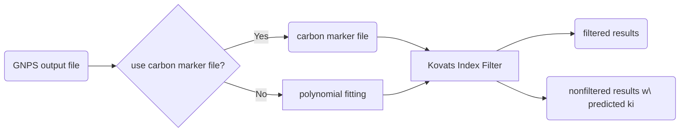

# Kovats Filter

In this project, we use kovats indices as standard measurement to filter out noises and outliers in GNPS output. 

## Idea
Kovats Retention Index maps compounds retention time to system independent constants. The relation shown below indicates that the kovates index of individual compound is normalized to the retention times of adjacently eluting n-alkanes. 

$I$ is 	Kovats index of the chosen compound. $n$, $N$ are the number of carbon atoms in the n-alkane eluting before and after the chosen compound respectively. $t_{r}(unknown)$, $t_{r}(n)$, $t_{r}(N)$  are corresponding retention time of the compound, n-alkane before and after. 

$$
I = 100\times \normalsize \bigg[ n\times (N-n)\frac{t_{r}(unknown)-t_{r}(n)}{t_{r}(N)-t_{r}(n)} \large \bigg]
$$

Under inconsistent temperature settings during production, data demonstrates a nonlinear, and monotonous increasing relation between Kovats index and retention time. Hence, polynomial fitting provides promising results of predicting Kovats retention indices of the unknowns, which can serve as an alternative to carbon marker files. 

***Library Used***: NIST Nonpolar Average Kovats Indices benchmarked by INCHI

## Workflow

## Input File Requirement

GNPS output.tsv: 

> Must contains following fields:
>  #Scan#, CAS, CAS_Number, Compound_Name, MQScore, INCHI, TIC_Query, RT_Query

Carbon Marker (Optional): 
> Must be in the same format as example/GC_kovats.tsv

## Output File 

Output.tsv 
> contains compounds that can be found in kovats library, and whose predicted kovats indice are in the input percentage error tolerance.

Nonfiltered.tsv 
> results before being filtered, with average kovats indices from the provided library and predicted kovats indices from either polynomial fitting or carbon marker calculation.

## Results
Use Polynomial Fitting:

    

## Reference

*Kovats, E. (1958). "Gas-chromatographische Charakterisierung organischer Verbindungen. Teil 1: Retentionsindices aliphatischer Halogenide, Alkohole, Aldehyde und Ketone". _[Helv. Chim. Acta](https://en.wikipedia.org/wiki/Helv._Chim._Acta "Helv. Chim. Acta")_. **41** (7): 1915–32. [doi](https://en.wikipedia.org/wiki/Digital_object_identifier "Digital object identifier"):[10.1002/hlca.19580410703](https://doi.org/10.1002%2Fhlca.19580410703).*

